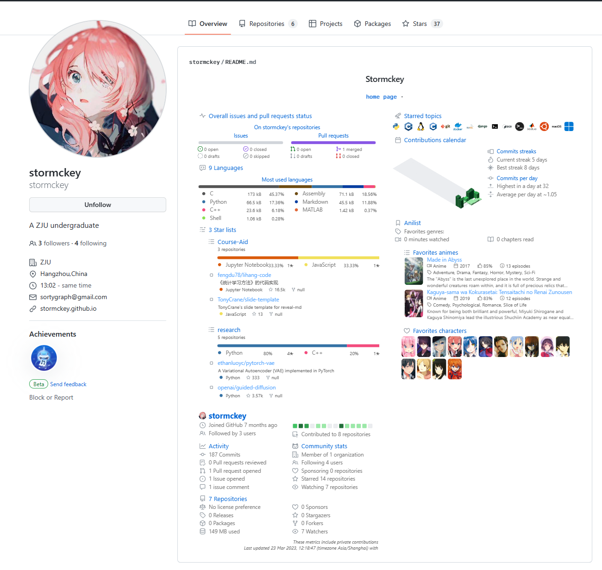

# 配置Github个人Profile

??? abstract 
    我配置Github主页Profile的方案，灵感来自[:octicons-link-16:Tonycrane的GitHub主页](https://github.com/TonyCrane)

## 启用Github主页Profile
我们先创建一个跟自己账号同名的公开仓库，这是一个特殊的仓库，Github会在主页上显示这一仓库的README文档，也就是实现Profile配置的仓库。
我们只要编写这个README文档就好啦
??? "本人主页预览"
    

## 启用Metrics生成 Profile图片

推荐使用[:octicons-link-16:Metrics](https://github.com/lowlighter/metrics/blob/master/.github/readme/partials/documentation/setup/action.md)来生成好看的Profile

Metrics使用GitHub Action自动更新，我们只要照着链接里的介绍就可以完成部署。Metrics还支持许多不同的[:octicons-link-16:插件](https://github.com/lowlighter/metrics/blob/master/README.md)，大家可以随意选择自己喜欢的，最后贴上笔者注释的的Action配置和README源代码,欢迎借鉴使用！

??? info "参考配置"

    === "Metrics.yml"

        ``` yaml
        name: Metrics
        on:
        # Schedule updates per hour
        schedule: [{cron: "0 * * * *"}]
        # (optional) Run workflow manually
        workflow_dispatch:
        # (optional) Run workflow when pushing on master/main
        push: {branches: ["master", "main"]}
        jobs:
        #generate the left picture 
        github-left-metrics:
            runs-on: ubuntu-latest
            permissions:
            contents: write
            steps:
            - name: left
                # use the official generator
                uses: lowlighter/metrics@latest
                with:
                token: ${{ secrets.METRICS_TOKEN }}
                
                # the file this action generates
                filename: matrics-left.svg
                config_timezone: Asia/Shanghai
                
                
                # enable plugins
                plugin_followup: yes
                
                
                plugin_languages: yes
                # repositories that wont be accounted
                plugin_languages_skipped: stormckey/dotfiles
                plugin_languages_ignored: html, css, ruby, perl, javascript
                # show the size of source code and percentage of each language
                plugin_languages_details: bytes-size, percentage
                
                
                plugin_starlists: yes
                plugin_starlists_languages: yes
                
                
                config_order: followup, languages, starlists
                
        github-right-metrics:
            runs-on: ubuntu-latest
            permissions:
            contents: write
            steps:
            - name: right
                uses: lowlighter/metrics@latest
                with:
                #disable the basic metrics 
                base: ""
                token: ${{ secrets.METRICS_TOKEN }}
                filename: matrics-right.svg
                config_timezone: Asia/Shanghai
                
                plugin_topics: yes
                plugin_topics_mode: icons
                
                
                plugin_isocalendar: yes
                
                
                plugin_anilist: yes
                plugin_anilist_user: stormckey
                plugin_anilist_sections: favorites, characters
                
                
                config_order: topics, isocalendar, anilist
                
                
        ```
        [查看文件](https://github.com/stormckey/stormckey/blob/main/.github/workflows/main.yml){ .md-button }
    === "README.md"

        ``` html

        <h3 align="center"> Stormckey </h3>

        <p align="center">
        <samp>
            <a href="https://stormckey.github.io/">home page</a> ∙
        </samp>
        </p>

        <p align="center">
        <a href="https://github.com/stormckey">
            
        </a>
        &emsp;
        <a href="https://github.com/stormckey">
            
        </a>
        </p>

        ```
        [查看文件](https://github.com/stormckey/stormckey/blob/main/README.md){ .md-button }