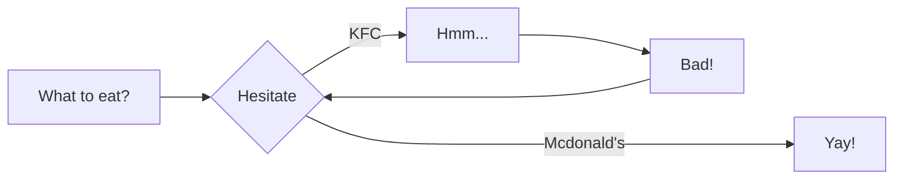

# 样式一览
!!! abstraction
    此页面将会列出本站点目前支持的所有显示样式
    许多都来自[:octicons-link-16: Material for Mkdocs](https://squidfunk.github.io/mkdocs-material/)

```C hl_lines="2 2"
int main(){
    printf("Hello World");
    printf("!/n");
}
```

```C++
#include <iostream>
using namespace std;
```

The `#!python range()` function is used to generate a sequence of numbers.

``` title="inlcude a file: .gitignore"
--8<-- ".gitignore"
```

{{ read_csv('./data.csv') }}




[:octicons-link-16:文档](https://mermaid.js.org/)介绍了所有支持的图

!!! note " my title"
    something

!!! tip ""
    no title

??? warning "my title"
    something

!!! info  "no inline"
    Now it suppports Note，Abstract，Info，Tip，Success，Question，Warining，Failure，Danger，Bug，Example，Quote

!!! abstract inline  "inline"
    somthing
[Subscribe to our newsletter](#){ .md-button }

[Subscribe to our newsletter](#){ .md-button .md-button--primary }

=== "C"

    ``` c
    #include <stdio.h>

    int main(void) {
      printf("Hello world!\n");
      return 0;
    }
    ```

=== "C++"

    ``` c++
    #include <iostream>

    int main(void) {
      std::cout << "Hello world!" << std::endl;
      return 0;
    }
    ```

!!! note
    Search for emojis [here](https://squidfunk.github.io/mkdocs-material/reference/icons-emojis/)

!!! Definition
    Define sth

Text can be {--deleted--} and replacement text {++added++}. This can also be
combined into {~~one~>a single~~} operation. {==Highlighting==} is also
possible {>>and comments can be added inline<<}.

{==

Formatting can also be applied to blocks by putting the opening and closing
tags on separate lines and adding new lines between the tags and the content.

==}

- ==This was marked==
- ^^This was inserted^^
- ~~This was deleted~~

- H~2~O
- A^T^A

++ctrl+alt+del++

:heart_eyes:{.heart}

:smile::sweat:

<figure markdown>
  { width="300" }
  <figcaption>Image caption</figcaption>
</figure>
{ loading=lazy }


- [x] Lorem ipsum dolor sit amet， consectetur adipiscing elit
- [ ] Vestibulum convallis sit amet nisi a tincidunt
    * [x] In hac habitasse platea dictumst
    * [x] In scelerisque nibh non dolor mollis congue sed et metus
    * [ ] Praesent sed risus massa
- [ ] Aenean pretium efficitur erat， donec pharetra， ligula non scelerisque

$$
\operatorname{ker} f=\{g\in G:f(g)=e_{H}\}{\mbox{.}}
$$

【鼠标悬停！】{😋}

[:material-information-outline:]{Important information}

[Hover me](https://example.com "I'm a tooltip!")

The HTML specification is maintained by the W3C.

`Lorem ipsum dolor sit amet`

:   Sed sagittis eleifend rutrum. Donec vitae suscipit est. Nullam tempus
    tellus non sem sollicitudin， quis rutrum leo facilisis.

`Cras arcu libero`

:   Aliquam metus eros， pretium sed nulla venenatis， faucibus auctor ex. Proin
    ut eros sed sapien ullamcorper consequat. Nunc ligula ante.

    Duis mollis est eget nibh volutpat， fermentum aliquet dui mollis.
    Nam vulputate tincidunt fringilla.
    Nullam dignissim ultrices urna non auctor.

| Method      | Description                          |
| :---------: | :----------------------------------: |
| `GET`       | :material-check:     Fetch resource  |
| `PUT`       | :material-check-all: Update resource |
| `DELETE`    | :material-close:     Delete resource |


