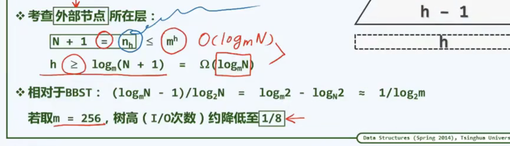

1.

    B 树利用了局部性来加速访问

    B 树的外部节点是指叶节点的空孩子

    

2.

    对 B 树的节点关键码数约定，注意下限是上取整，可用上下限命名
    如（3，5）树/5 阶 B 树，5 阶 B 数一个节点最多 4 个关键码

    

3.

    B 树在内存中实际的存储形式为

    

4.

    注意 外部节点数=内部节点数+1

    

    也可理解为内部节点对应 N 种成功，外部节点就是对应的 N+1 种失败的情况

5.

    B 树的高度就在、\thetalogmn

    

6.

    B 数的插入，如果导致节点 key 过多，则需要分裂，并把中点上移

    

    如果分裂到根 那么高度加 1

7.

    B 树的删除，如果导致下越界，但凡左右有一个兄弟有多的（借出后不下溢出），旋转

    

    如果没有， 从上面拽一个下来，三部分一起合并

    

    合并到根，就把空根删除，至此高度减一

8.

    B 树把数据存在节点中，比起 B+树存在根中，B 除了 key 多了个指针的大小.除去指针索引可以容纳宽扁的树。

    另外加入要查找某一区间的点比如 20-60，需要依次搜索，很麻烦

    引入 B+树：

    

    索引值（内部点）不重复；

    不再需要 B 树的外部节点；

    叶子块单向链表，方便查找某个范围内的值，不必多遍从根出发。

    索引值（内部点的 key）存的是右子树的最小叶子节点的值。

    如果有磁盘指针，也都存在有节点。

    插入删除与 B 树相仿.但都要深入到叶节点。
