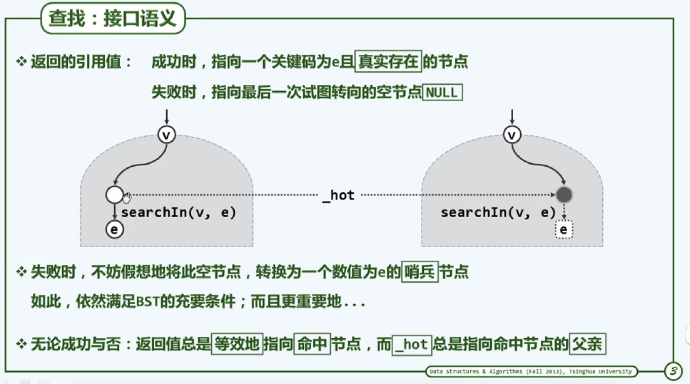
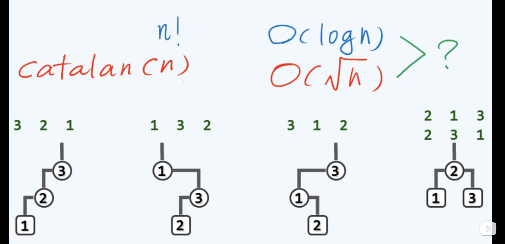
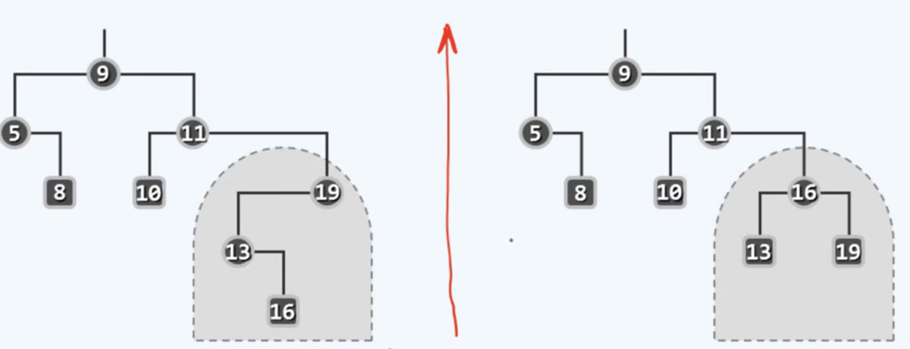
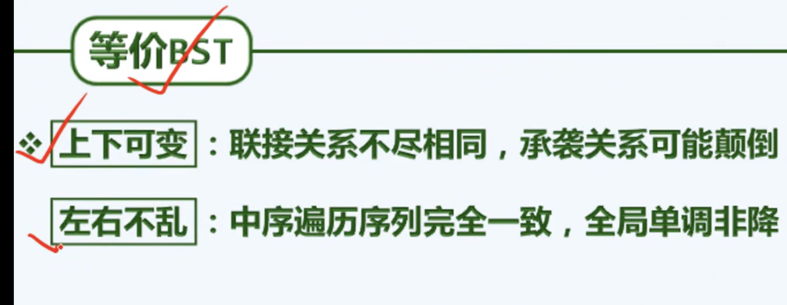
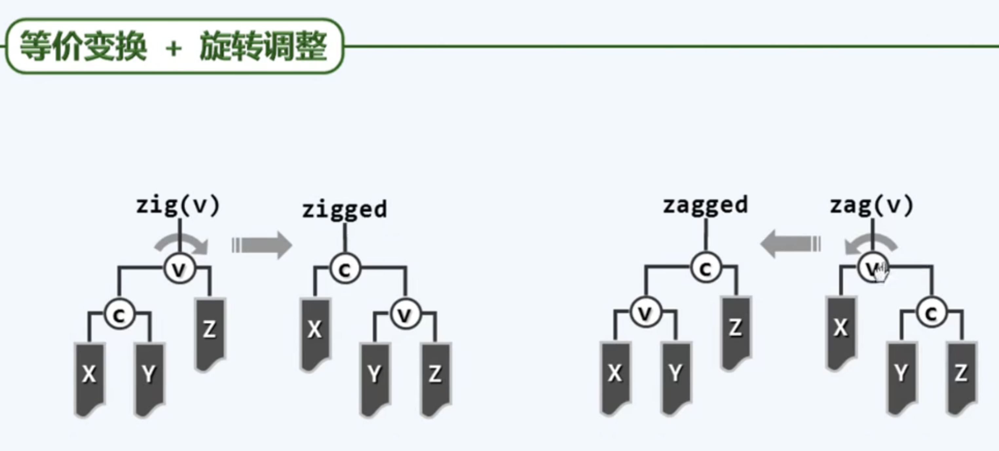
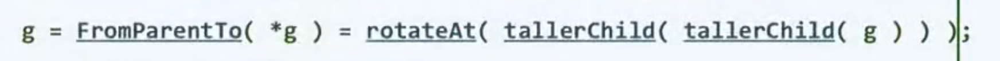
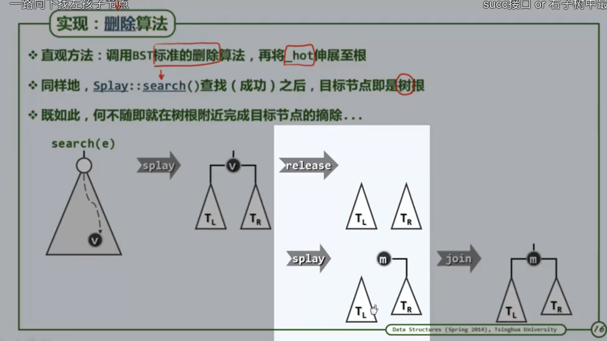

1.  我们在调用 search 时会多传递一个引用的参数 hot 其意义如下：

    

    这有利于我们实现 insert delete

2.

    BST 的平均高度，有两种计算方式

      1.  随机组成：计算一共有多少种可能的拓扑结构 根号 n Catalan（N）种结构

      2.  随机生成：计算一共有多少种可能的输入序列 ln N N！种序列

    

    随机组成更加可信，因为随机生成会额外增大 213 和 231 这一较低树的权重，重复了

3.等价 BST

    上下具有一定的灵活度

    

    

4.

    

    左分叉是 zig 右分叉是 zag，旋转可以保持 BST 的等价

5.

    AVL 的插入可能会导致一系列祖先的失衡，但是删除只可能导致某一个祖先的失衡

6.

    

    注意到我们找到第一个失衡点之后，循环走啊路径只要往下找两次高度最高的孩子就好

7.

    伸展树的删除和插入，由于 1 都需要用 search 操作，search 完后 self/hot 会成为新的根节点，我们的插入删除只要在搜索完后对根操作即可。

    

