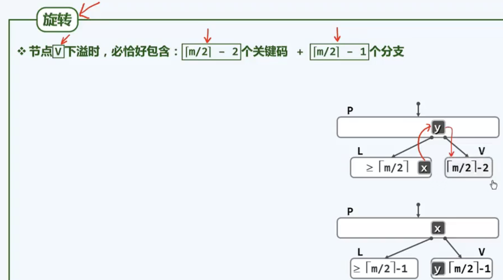

1. 

    我们在调用search时会多传递一个引用的参数hot 其意义如下：

    

    这有利于我们实现insert delete

2. 

    BST的平均高度，有两种计算方式

    1.  随机组成：计算一共有多少种可能的拓扑结构 根号n Catalan（N）种结构

    2.  随机生成：计算一共有多少种可能的输入序列 ln N N！种序列

    

    随机组成更加可信，因为随机生成会额外增大213和231这一较低树的权重，重复了

3. 等价BST

    上下具有一定的灵活度

    

    

4. 

    

    左分叉是zig右分叉是zag，旋转可以保持BST的等价

5. 

    AVL的插入可能会导致一系列祖先的失衡，但是删除只可能导致某一个祖先的失衡

6. 

    

    注意到我们找到第一个失衡点之后，循环走啊路径只要往下找两次高度最高的孩子就好

7. 

    伸展树的删除和插入，由于1都需要用search操作，search完后self/hot会成为新的根节点，我们的插入删除只要在搜索完后对根操作即可。

    
