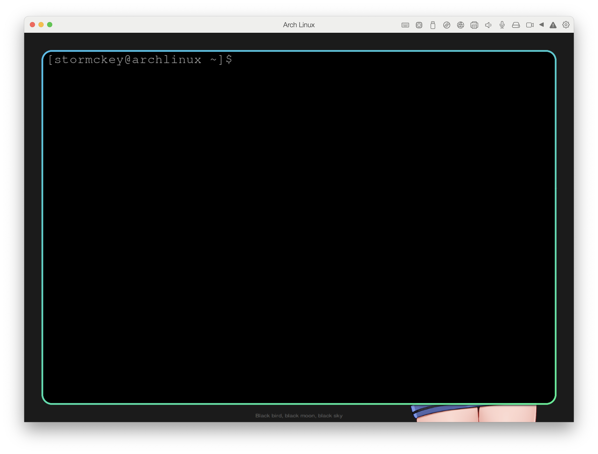

# Arch Linux Day1

!!! abstract
    开始折腾 Arch Linux 的第一天！

<!-- more -->

## 引言

为什么突然开始想要折腾 Linux 了？其实有多方面的原因：

-   第一个原因就是一直缺少一个续航长的轻薄笔记本，但是一直没有实现，大学开始的时候买的是一个 2.1kg 的游戏本，续航 2h 不到。至今都还记得大一费劲的背着电脑去上程算结果还没下课就关机了😇。

    后来我爸突然给我买了台 macbook pro 16 英寸，重量减轻了足足 0.1kg，并且 intel 芯片的 macbook 嘛，续航也很难说达到了令人满意的水平（3-4h 吧）。

    所以为了满足这方面的需求，就一直在观察着新出的笔记本，并且由于续航的原因大部分时候都在盯着 macbook，因为其他阵营的续航还真就没一个能打的。

    但前一段时间新发布的 m3 mbp 产品线实在是刀法太恶心人了，疯狂阉割，就是要让人说着虽然这边阉一点那边阉一点问题也不大啦然后为了新芯片去购买它，好像非要到 m3max 才能感觉没被恶心到，但那性能就溢出太多了。而 mbp m1pro 算是跟方面都没有阉割的一版但又会感觉芯片略有点旧了。

    一看 PC 阵营，机械革命的无界 14pro 首发 3999 实在是香，现在的话无界 13+搭载 AMD R7-7840HS 只要 2599，搭载 2.8K 屏 120HZ（虽然观感一般）但都这价位了还要什么自行车。相比之下 10000 的 mbp m1pro 就显得有点冤种了。

    不过一大问题是，用了这么久 MacOS 实在是觉得 windows 的系统没有达到可用的水平😇，续航也不行，除了打游戏非常方便很难说有别的优点。

    那么怎办呢，当然是买一台便宜强劲（如无界 14+）的电脑同时配置一个比较好用的系统啦，所以就要开始折腾 Linux

-   第二个原因就是最近在备战托福但是放寒假了又想摸鱼，然后就在油管上看了不少英文视频。当时就注意到了非常流畅的 hyperland（tiling window manager），然后渐渐的就对这方面感兴趣了。
-   最后一个原因其实就是我本身就挺喜欢这种 customizable 的东西，所以折腾起来也感觉不错。
-   这学期刚好学完了 OS

## 为什么是 Arch Linux

-   首先感觉很酷，并且可以在玩系统的过程中学点东西
-   然后想要使用 hyperland 的话是需要一些最新的软件的，所以只对 Arch Linux， NixOS 一类的系统支持比较好
-   我比较爱折腾

## 今天遇到的问题

是的，所以接下来就遇到问题了😇。

首先是 intel 的 mbp，它不让我装，我选了从 U 盘启动它就跳走问我是不是要在上面装一个 MacOS（？）

然后用游戏本呢，此时唯一遇到的问题是安装的过程中选择磁盘时没有 SSD，只让我装在 U 盘上，奔前走后也不知道该怎么解决（作的😇）

## 成功做到的

### 虚拟机

下午又小捣鼓了一会儿在 pd 上装好了 arch linux



算是初步跑起来了吧， 后面要怎么办我也不太清楚，可以先在虚拟机上先捣鼓捣鼓看看效果如何。

哦对了，在 pd 上跑我遇得到问题是没法 cmd+q 呼出 kitty 终端，方法是用 cmd+r 手动启动 kitty，然后去配置里另设一个快捷键，就可以用快捷键启动 kitty 了。

### 移动硬盘

但是虚拟机上在太卡了，于是我一转移动硬盘，虽然说 90 块的小硬盘盒最高读写速度也就 1GBps 左右，但是也将将够用了。

有几步可能要注意的：

开始安装之前可以换源，虽然我没换。

无线网的话要用`iwctl`先联网，可以用`baidu.com`测试

然后可以设置`http_proxy https_proxy all_proxy`等环境变量到同一局域网下允许局域网连接的梯子的对应端口，就可以走代理了。

接下来都是常规设置，`profile`中`window`我选择的是`hyperland`

如果开始安装了之后卡在了某一步 reflector 一类的话，可以试试在安装之前输入

```bash
systemctl mask reflector.service
systemctl stop reflector
```
起码这对我是有效的。

安装完成后什么 post installation 选 no，然后重启即可。

#### 网络
刚进来并没有网，作为小白跟安装的时候一样直接用`iwctl`结果等 daemon 等了半天，原来 daemon 要自己手动开💦

```bash
systemctl start iwd
```

但是用了 iwctl 也不能像之前那样直接连上了，我也不知道为啥

最后转而使用`nmcli`,其实也没啥熟悉一下语法就行了，顺便一提`iwctl`找不到我的热点但是`nmcli`可以

还有很诡异的事情是连接校网不需要账号密码

#### 大杂烩
初进 hyperland 的字体对我来说太大了，去配置文件中将 monitor 一项的最后一个 auto 改成 1 会好很多，这一项是缩放系数，系数越大，字体越大

随后试着安装了 nix 来进行包管理，但感觉并不算特别方便🤔

首先是 zsh 装在了奇怪的地方，我用了软连接连到`/bin/zsh`去了

nix 似乎也可以装字体，但我不知道装到哪去了，起码我翻了一下字体文件夹没看见，所以最后用`pacman`装了 meslo，然后在 kitty 的配置文件中加了一行`font_family MesloLGS NF`，这样就可以用了

终端美化参考之前的 [:octicons-link-16:博客](https://stormckey.github.io/blog/linux-%E7%BB%88%E7%AB%AF%E9%85%8D%E7%BD%AE/)。

nix 装`autojump`同样不行，并不直接提供 j 而是提供 autojump，并且好像没有包含 script 所以跑不通。

我最后选择用 pacman 从 aur 中安装：

```bash
# first install base-devel
sudo pacman -S base-devel
# then clone the repo from aur
git clone https://aur.archlinux.org/autojump.git
# then cd into the repo
cd autojump
# then build the package
makepkg -si
```

上面的做完了之后还会提示将一行命令加入 bashrc 中。

接下来是安装 QQ，我是直接用 nix，注意到中文刚开始显示不出来，在 wiki 中提示使用`winetricks fakechinese`可解决

截图工具似乎要自己备，我选了`grimblast`


