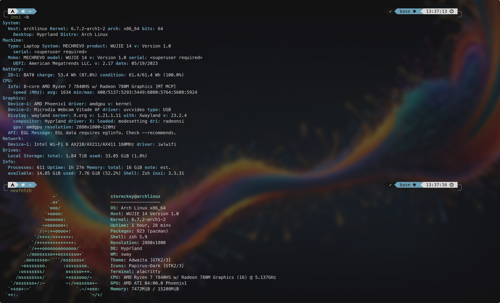

# Arch Linux + Hyprland 安装全流程

!!! abstract
    今天很不幸的经历了第二和第三次的重装系统😇，在间隙决定把一整个流程写下来，供大家（以及以后的我）参考
    
    后续：此流程在搭载7840HS的机械革命无界14+上可以顺利跑通

<!-- more -->

!!! info "硬件信息"
    

## 启动盘

- 前往 arch linux 官网下载最新镜像，后缀 iso
- 随机选一个烧录工具（最常见的 ecther）和一个空的 U 盘/移动硬盘
- 选择下载的 iso 文件和插进去的启动盘，烧录

## 从启动盘启动

重启笔记本按 f2 进入 bios，关闭 secure boot（可能需要先设置密码才能关），选择优先从启动盘启动而非 ssd 上的 windows

保存并退出

接下来就会进去启动盘上的系统，这个系统是拿来给我们安装用的

## 准备工作

进入启动盘的终端

无线网的话，首先用 iwctl 联网，参考 [:octicons-link-16:这篇](https://blog.csdn.net/mnmiaoyi/article/details/109398007) ，有线不需要这一步

此时 curl baidu.com 应该是通的

然后还需要代理（或者换源也可以？我一直是代理），在另一个设备上开启 clash 的允许局域网联机，并且记住该设备的 ip 和端口（一般是 7890 端口）

然后用环境变量设置代理，我一般设置 http_proxy,https_proxy,all_proxy 三个，格式为

```bash
export http_proxy=http://ip:7890 https_proxy=...
```

此时 curl google.com 应该是通的

然后 vim /etc/pacman.conf 把并行下载的注释去掉，开启并行下载

最后 archinstall 开始安装

## archinstall

!!! warning
    如果 archinstall 后卡在了某个 reflector 那里动不了的话，试试
    ```bash
    systemctl mask reflector.service
    ```
    或者
    ```bash
    systemctl stop reflector
    ```

!!! warning
    如果你有一整个硬盘来装载 Linux 系统的话，可以直接在 Disk 中选择第一项 use the best,这会抹掉并且使用整个硬盘的空间

    如果你希望在同一个硬盘上保留 windows 和 Linux 双系统的话，需要手动做好分区挂载等等，可以参考 [:octicons-link-16:视频](https://www.youtube.com/watch?v=9jTk3K3ExaI)


进入 archinstall 设置页面

mirrors 进去第一项然后选择地区就好，我选择中国，完毕后 locales 也一并被 defined 了

disk configuration 进入后选择第一项最大化利用，然后选择你想要安装的盘，文件系统我选 btrfs，后续的选项都是默认

!!! bug
    此处我不知道为什么是无法选择电脑内部的盘而只能选择这个安装介质，我还不知道怎么解决这个问题，现在我的系统就装在当时的安装介质，也就是一块移动硬盘上面

可以不加 root password 只要创建一个 user 并且加入 sudo 就可以了

profile 选择 desktop ， hyprland，后续选项中唯一注意的是显卡驱动使用开源驱动还是 n 卡专有驱动，n 卡专有驱动更强大一点但是可能会有位未知的问题（兼容性不好）

!!! tip "路径分岔"
    此处有一分支选项，可以选择只安装 minimal 然后使用其他开发者提供的 dotfiles 进行安装，推荐使用的有 [:octicons-link-16:这份](https://gitlab.com/stephan-raabe/dotfiles) 以及相应的 [:octicons-link-16:视频](https://www.youtube.com/watch?v=kHG5czrQ7WA) ，详情请查看相应介绍

network configuration 选择 use network management

timzezone 选上海

optional repo 选择 multilib

然后安装

!!! bug
    在此处我还遇到了一个找不到到 uuid 的 bug，输入指令 lsblk -f 后发现确实有一个分区没有 uuid，为了修复这个问题，我选择了上文提到的视频中的手动分区的方法，因为自动分区疑似不会给我们加 swap 分区

结束后 post-installation configuration 直接选 no 然后 reboot 重启

## 初步配置

### hyprland 本身

进入后 super+q（win+q）呼出终端

首先修改~/.confi/hypr/hyprlnd.conf

把 autogenerated 那一行注释掉，去掉顶部通知栏

把 monitor 的最后一个 auto（缩放倍数）改成 1，退出

### 时区设置

如果安装的时候忘了选时区，请参考这篇 [:octicons-link-16:博客](https://blog.csdn.net/chuiqingdian1964/article/details/101049514)

### 联网

不推荐继续使用 iwctl，因为我用了以后连不上并且它搜不到热点，如果要用的话要记得先用 systemctl start iwd 开启 daemon

使用 nmcli，教程网上都是，我用的是

```bash
nmcli dev wifi connect ZJUWLAN
```

就可以了

然后一样的代理，测试 baidu 和 google 的连通性

### Pacman 设置

其实需要改得不多，之前提到的并行下载，还有 Color 也可以像开启

还可以加入一行 ILOveCandy 来把进度条切换成 pacman 特有的吃豆子样式

接下来是换源，首先安装 reflector(1)
{.annotate}

1.  extra/reflector 2023-1
    A Python 3 module and script to retrieve and filter the latest Pacman mirror list.

```bash
sudo pacman -S reflector
```

然后备份

```bash
sudo cp /etc/pacman.d/mirrorlist /etc/pacman.d/mirrorlist.bak
```

然后使用该指令寻找十个最快的源：

```bash
sudo reflector --verbose --latest 10 --country China --protocol https --sort rate --save /etc/pacman.d/mirrorlist
```

最后更新一下 pacman

```bash
sudo pacman -Sy
```


### shell 切换

```bash
sudo pacman -S zsh firefox ttf-meslo-nerd git
chsh -s zsh
```

然后切换 kitty 的默认字体

在~/.config/kitty/kitty.conf 中加入

```bash
font_family MesloLGS NF
```

如果是alacrity终端的话，应该使用的是
```toml
[font.normal]
family = "MesloLGS Nerd Font"
style = "Regular"
```

具体一个字体应该用什么来指代，可以参考fc-list的输出

然后可以参考我的这篇 [:octicons-link-16:博客](https://stormckey.github.io/blog/linux-%E7%BB%88%E7%AB%AF%E9%85%8D%E7%BD%AE/) 进行美化，使用 firefox 打开可以直接复制命令

我是跑完 powerlevel10k 那一段后直接令开一个终端进入 zsh 开始初始化 powerlevel10k 了

新的 shell 中 proxy 又失效了，直接把 export 那一行在 zshrc 中设置为 proxy 的 alias，此后就用 proxy 直接启动代理，直到我们跑起来本计算机的代理

新的终端中继续完成终端的优化

其中 autojump 位于 aur 中，通过

```bash
# first install base-devel
sudo pacman -S base-devel
# then clone the repo from aur
git clone https://aur.archlinux.org/autojump.git
# then cd into the repo
cd autojump
# then build the package
makepkg -si
```

安装，并依照提示把响应命令输入.zshrc


### 输入法

```bash
sudo pacman -S fcitx5-im fcitx5-chinese-addons
```

!!! warning
    fcitx5-im 内部包含四个包，我的建议是全都下，我之前只下了前两个结果 qq，vscode 一类的 xwayland 的程序死活没法用输入法，我把后两个包加装回去就可以了

先跑
```bash
fcitx5 --replace -d
```

!!! bug
    对我而言此处会有一个 DBus call error，或者是三个，但其实不用管，虽然有这个 error 但是输入法还是照样可以使用的，我两次重装系统就是因为无法去掉这个 error ，还以为输入法就跑不了了，重装是为了从 nvidia 的专有驱动换到开源驱动看看能不能解决问题，答案是不能😇

启动 fcitx5-configtool，去掉 only show current languages,滑到底双击 pinyin，apply

!!! bug
    如果启动 fcitx5-configtool 的过程中出现 Could not find the Qt platform plugin 的问题，请安装 qt5-wayland

不出意外此时 ctrl+space 就可以切换到输入法了，虽然看起来全是乱码，我们还需要中文环境

安装中文字体

```bash
sudo pacman -S noto-fonts-cjk
```

在/etc/locale.gen 中去掉 zh_CN.UTF8 那一行的注释，保存后执行 locale-gen 指令，然后重启

现在只要我们像上面一样启动 fcitx5 --replace -d 就可以切换输入法了，我们可以吧这一项集成进 hyprland 启动项中

```title="hyprland.conf"
exec-once=fcitx5 --replace -d
```

按照一般的教程，还需要添加以下环境变量到/etc/environment 中

```bash
QT_IM_MODULE=fcitx
XMODIFIERS=@im=fcitx
SDL_MOULE=fcitx
```
作用是什么暂时还不知道

重启可以看出已经自动启动了

但是根据hyprland的提示似乎我们需要去掉第一项，我最后只保留了中间一项，工作正常，作用是什么以后再研究把

于我而言，上面选择的pinyin对emoji的支持不是很好，需要配置一个对emoji支持很好的输入法的话，可以参考 [:octicons-link-16:博客](https://blog.beautyyu.one/archlinux-gnome-chinese-input-fcitx5-rime-ice-solution)

还可以修改输入法的主题，我是用的是 [:octicons-link-16:这个]（https://github.com/thep0y/fcitx5-themes）中的macOS-dark


### QQ

qq 并不在 extra 目录中，而是跟 autojump 一样在 aur 中，为了从 aur 中安装，我们可以像 autojump 那样 clone repo 然后 makepkg，也可以使用一些自动化工具来帮我专门做这件事，比如 yay 或者 paru（用 rust 重写的）

```bash title="安装 yay"
git clone https://aur.archlinux.org/yay.git
cd yay
makepkg -si
```

然后用 yay 安装 qq

```bash
yay -S qq
```

两个选项一般选 None

安装完毕后用 linuxqq 命令就可以启动 qq 了

### python 环境

首先用 yay 安装 anaconda

```bash
yay -S anaconda
```
安装完成后按照指示 activate 了之后就可以在命令行使用 conda 了

然后如常使用即可，我的 pip 也是用 conda 装的因为 pacman 装的似乎和 conda 配合得不是很好

IDE 选择 code

```bash
sudo pacman -S code
```

### 命令行工具

有些用 rust 重写的命令行工具都还挺好用的

- bottom
- eza
- bat

并且可以使用 alias 无感代替它们的原版

### 代理

很不幸的是 clash 一系前不久删库跑路了，不过还有一支 clash-verge-rev 仍然在维护，我们可以从 aur 安装

```bash
git clone https://aur.archlinux.org/clash-verge-rev-bin.git
cd clash-verge-rev-bin
makepkg -si
```

完成后使用 clash-verge 启动即可，用法是使用机场给的 url

但我貌似开启了 system proxy 之后其他的应用仍然没有直接走梯子？

对于这样的情况，我们可以手动设置 system proxy

在/etc/environment 中加入

```bash
http_proxy=http://127.0.0.1:7897
https_proxy=http://127.0.0.1:7897
all_proxy=http://127.0.0.1:7897
```

重启实验即可

如果想要随 hyprland 自启动的话，hyprland 配置文件加入

```bash
exec-once=calsh-verge
```
### 外接显示器

这个 hyprland 的官网说的比较清楚了，tldr：

首先用 hyprctl monitors list 列出所有连接的显示器，找到你要设置的显示器的标识符，比如我这里是 HDMI-A-1

然后在~/.config/hypr/hyprland.conf 中修改 monitor 的配置
比如我的第二块屏幕的配置就是

```bash
monitor=HDMI-A-1,preferred,auto,1.666667
```
更多诸如刷新率色深之类的请参考官网

### 截图

使用 yay 安装 grimblast，如果没有 wl-clipboard 的话，还需要用 Pacman 来安装 wl-clipboard

### 其他

其他还可以安装的工具有

- neofetch
- flatpak
- preload： app启动加速
- auto-cpufreq： 省电
- amd-ucode/intel-ucode： 增强内核稳定性
- libreoffice-fresh： office替代
- gimp
- thunderbird
- krita
- vlc
- ufw： 高度可配置的防火墙
- keyd： 高度可配置的键盘映射管理
- ranger： 高度可配置的文件管理器，对于文本的预览支持很好
- usbutils： 查看与管理设备
- libinput-gestures： 多指滑动和按压手势，可以触发制定的脚本或者把特定的按键组合发给当前应用（xwayland独占，貌似）
- rofi: 程序启动和app切换

还有一些好用的 hyprland 的设置：

- input:touchpad:natural_scroll
- input:touchpad:tap-and-drag： 轻点后可拖拽/选中
- input:touchpad:drag_lock： 拖拽/选中过程中间允许短暂的离开触控板
- input:accel_profile: 指针加速

除此之外还有一些可以自行设置的比如开机自动启动代理（理论上只需要后台启动代理而不需要gui,但是我还没搞清楚要怎么实现，目前是用hyprctl把gui杀掉），QQ,微信等


